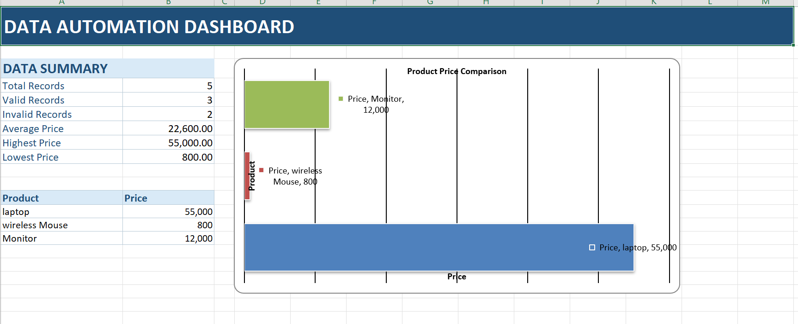

# Python Data Automation & Reporting Tool

A Python-based data automation tool that extracts product data from CSV files, HTML files, or authorized web pages, cleans and validates the data, calculates statistics, and generates professional Excel reports with a dashboard and charts.

## Features

- Read product data from CSV files
- Extract product data from HTML files
- Support authorized HTTP/HTTPS URLs
- Validate input data
- Clean currency and price values
- Remove invalid records
- Calculate average, highest, and lowest prices
- Generate Excel reports
- Generate an Excel dashboard
- Create product price comparison charts
- Command-line interface
- Error handling
- Logging

## Technologies Used

- Python
- Pandas
- NumPy
- BeautifulSoup4
- Requests
- OpenPyXL

## Project Structure

```text
data-automation-engine/
│
├── input_data/
│   └── products.csv
│
├── test_data/
│   └── products.html
│
├── main.py
├── scraper.py
├── processor.py
├── exporter.py
├── requirements.txt
├── README.md
└── .gitignore

## Dashboard Preview

The generated Excel report includes a data summary dashboard and product price comparison chart.


